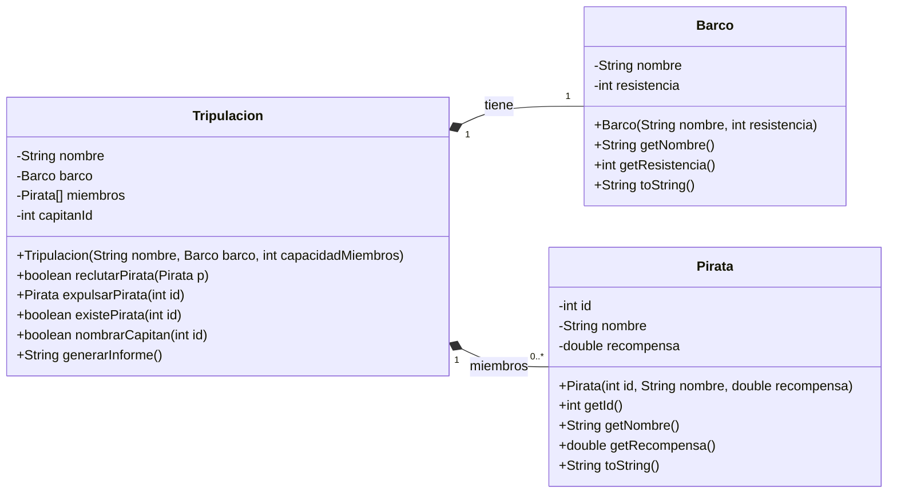

# prog-onepiece

Gestión de Tripulación Pirata en Java

# Proyecto Individual – Sistema OnePiece Crew

## Fecha de entrega

**(Se comunica en clase)**

---

## Objetivo

Diseñar e implementar el modelo inicial de un sistema de gestión de una tripulación pirata inspirado en el universo de **One Piece**.

En esta fase se trabajará:

* Diseño de clases
* Encapsulación
* Constructores
* Arrays de tamaño fijo
* Búsqueda e inserción manual en arrays
* Métodos sin impresión en consola
* Separación de responsabilidades
* Uso correcto de Git (commits progresivos y estructurados)

---

## Escenario

Una tripulación pirata necesita un sistema para gestionar:

* Sus miembros
* Su barco
* Su capitán

Cada pirata tiene:

* Un identificador único
* Un nombre
* Una recompensa (bounty)

Cada barco tiene:

* Un nombre
* Un nivel de resistencia

La tripulación:

* Tiene un nombre
* Puede almacenar un número fijo de piratas
* Tiene un capitán (que debe pertenecer a la tripulación)

## Diagrama de clases



---

# Preparación del Proyecto

Antes de comenzar:

1. Crear un **nuevo proyecto Java en IntelliJ**.
2. Crear un **repositorio local con Git**.
3. Hacer el primer commit
6. Hacer `push` inicial.

> 🔨 Haz un commit + push en este punto
>
> Ejemplo de mensaje del commit:
>
> `chore: inicializa proyecto OnePiece Crew con estructura base`

---

# Microentrega 1 – Clase `Pirata`

## Atributos (privados)

* `id` (int)
* `nombre` (String)
* `recompensa` (double)

## Constructor

Debe inicializar todos los atributos.

## Métodos obligatorios

```java
int getId()
String getNombre()
double getRecompensa()
String toString()
```

Formato obligatorio de `toString()`:

```
[id] nombre - Recompensa: X berries
```

No se permite generar código automáticamente.

> 🔨 Haz un commit + push en este punto
>
> Ejemplo de mensaje del commit:
>
> `feat(Pirata): implementa clase Pirata con atributos, constructor y toString`

---

# Microentrega 2 – Clase `Barco`

## Atributos (privados)

* `nombre` (String)
* `resistencia` (int)

## Métodos obligatorios

* Constructor
* Getters
* `toString()`

Formato libre pero claro.

> 🔨 Haz un commit + push en este punto
>
> Ejemplo de mensaje del commit:
>
> `feat(Barco): implementa clase Barco con constructor y getters`

---

# Microentrega 3 – Prueba básica en `Main`

Sin arrays todavía.

* Crear 2 piratas.
* Crear 1 barco.
* Mostrar su información por consola.

`Main` es el único lugar donde se puede imprimir por pantalla.

> 🔨 Haz un commit + push en este punto
>
> Ejemplo de mensaje del commit:
>
> `feat(Main): añade prueba básica creando piratas y barco en Main`

---

# Microentrega 4 – Clase `Tripulacion`

## Atributos

```java
String nombre
Barco barco
Pirata[] miembros  // tamaño fijo (por ejemplo 8)
int capitanId      // inicializado a -1
```

No se permite usar ArrayList.

---

## Gestión de miembros

### Registrar pirata

```java
boolean reclutarPirata(Pirata p)
```

* Inserta en la primera posición libre.
* No permite IDs repetidos.
* Devuelve `true` o `false`.

> 🔨 Haz un commit + push en este punto
>
> Ejemplo de mensaje del commit:
>
> `feat(Tripulacion): implementa reclutarPirata con control de duplicados`

---

### Expulsar pirata

```java
Pirata expulsarPirata(int id)
```

* Elimina si existe.
* Devuelve el objeto eliminado.
* Si no existe → `null`.

> 🔨 Haz un commit + push en este punto
>
> Ejemplo de mensaje del commit:
>
> `feat(Tripulacion): implementa expulsarPirata devolviendo el miembro eliminado`

---

### Comprobar existencia

```java
boolean existePirata(int id)
```

> 🔨 Haz un commit + push en este punto
>
> Ejemplo de mensaje del commit:
>
> `feat(Tripulacion): añade método existePirata para búsqueda por id`

---

### Designar capitán

```java
boolean nombrarCapitan(int id)
```

* Solo válido si el pirata pertenece a la tripulación.
* Actualiza `capitanId`.

> 🔨 Haz un commit + push en este punto
>
> Ejemplo de mensaje del commit:
>
> `feat(Tripulacion): implementa nombrarCapitan validando pertenencia`

---

## Informe de la tripulación

```java
String generarInforme()
```

Debe devolver un texto que incluya:

* Nombre de la tripulación
* Nombre del barco
* Número de miembros ocupados / capacidad
* Capitán actual
* Listado de piratas

No debe imprimir nada.

> 🔨 Haz un commit + push en este punto
>
> Ejemplo de mensaje del commit:
>
> `feat(Tripulacion): implementa generarInforme con resumen completo de tripulacion`

---

# Microentrega 5 – Prueba final en `Main`

* Crear barco.
* Crear tripulación.
* Reclutar 3 piratas.
* Nombrar capitán.
* Mostrar informe.

> 🔨 Haz un commit + push en este punto
>
> Ejemplo de mensaje del commit:
>
> `feat(Main): integra prueba final con reclutamiento y nombramiento de capitan`

---

# Reglas Importantes

1. No se permite generación automática de código.
2. No se permite copiar código.
3. No se permite usar IA generativa para escribir el código.
4. No se permite usar `ArrayList`.
5. No se permite `break` fuera de `switch`.
6. El proyecto debe compilar sin errores.
7. Solo `Main` puede imprimir.

---

# Requisitos de Control de Versiones

Mínimo obligatorio:

* 6 commits reales.
* Cada commit debe representar una microentrega.
* Mensajes descriptivos.
* No se aceptan commits masivos finales.

Se valorará:

* Claridad del histórico.
* Progresión lógica.
* Uso correcto de `push`.

---

# Criterios de Evaluación

* Encapsulación correcta
* Inserción en primera posición libre
* Control de repetidos
* Gestión correcta del capitán
* Calidad del código
* Separación de responsabilidades
* Histórico Git coherente

---

# Defensa Oral

Podrás ser preguntado sobre:

* Cómo funciona la inserción en primera posición libre.
* Por qué no se usa `ArrayList`.
* Cómo se controla que no haya IDs repetidos.
* Qué ocurriría si se elimina al capitán.

---

# Extensión voluntaria

* Método que devuelva el pirata con mayor recompensa.
* Método que calcule la recompensa total acumulada.
* Validaciones que lancen `IllegalArgumentException`.
